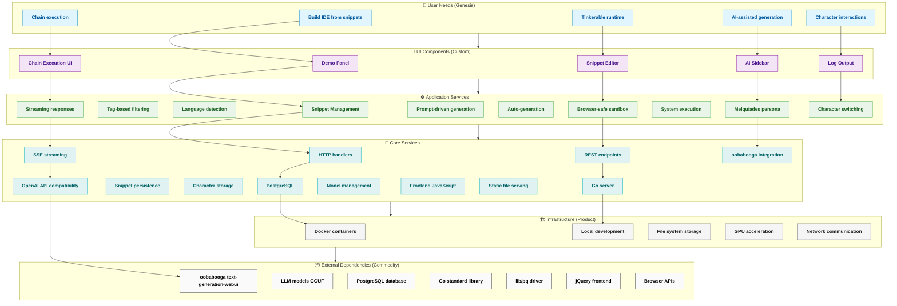

# Melquíades Architecture - Wardley Map

## Architecture Overview

### **User-Facing Components (Visible)**
- **Demo Panel**: Main IDE interface with three-column layout
- **Snippet Editor**: Multi-language code editing with tabs (Prompt/Snippet/Run)
- **Chain Execution**: Orchestrate multiple snippets together
- **AI Sidebar**: Character-based AI interactions and suggestions
- **Log Output**: Real-time execution feedback

### **Core Application Services**
- **Snippet Management**: Create, save, load, filter snippets by tags/language
- **AI Generation**: Streaming responses, prompt-driven generation, auto-generation
- **Execution Engine**: Browser-safe iframe sandbox + system execution
- **Character System**: Melquíades persona with context-aware responses

### **Technical Stack**
- **Frontend**: Vanilla JavaScript + jQuery, no build step
- **Backend**: Go with PostgreSQL
- **AI**: oobabooga text-generation-webui integration
- **Infrastructure**: Docker containers, local development

### **Key Features**
- **Tinkerable Runtime**: Edit and execute snippets at runtime
- **Character-Driven AI**: Melquíades persona for consistent responses
- **Chain Orchestration**: Auto-generate missing snippets in chains
- **Multi-Language Support**: HTML, CSS, JS, Python, Go, SQL, Bash, etc.
- **Sandboxed Execution**: Safe browser execution for web technologies

### **Evolution Strategy**
- **Genesis**: AI generation and character systems (innovative, evolving)
- **Custom Built**: UI, snippet management, execution (unique value)
- **Product**: Database layer (PostgreSQL - mature solution)
- **Commodity**: External services and libraries (standardized)
